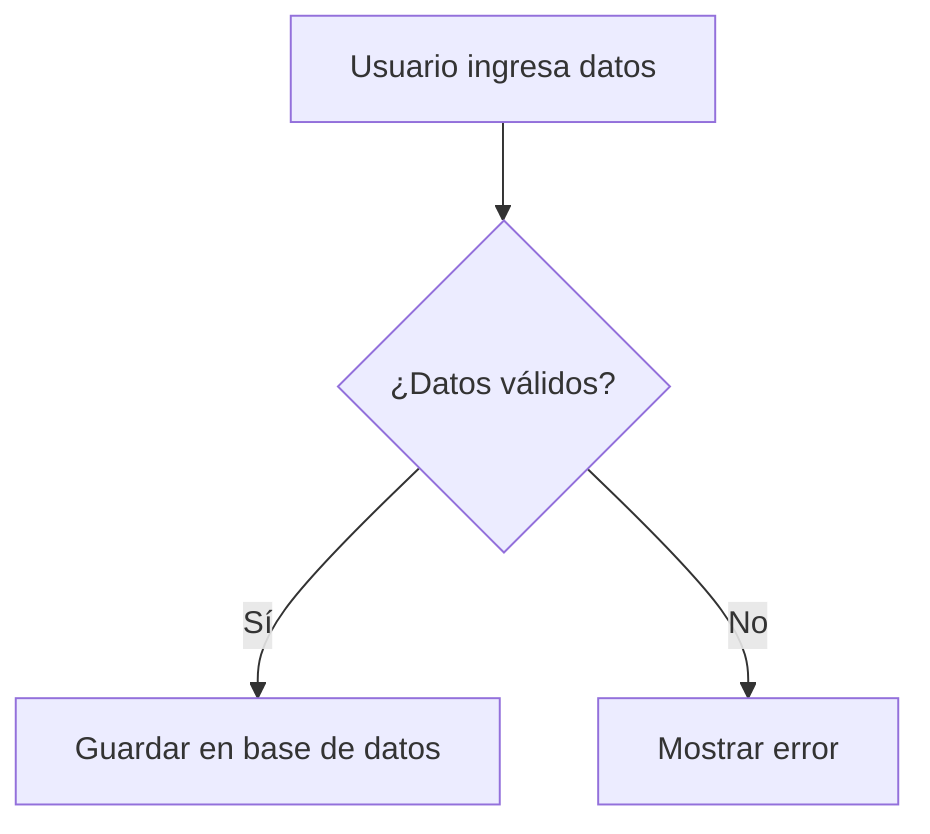

<section class="blog-reveal">

## 1. INTRODUCCIÓN

Toda herramienta CASE de **análisis y diseño** existe para resolver el mismo problema: convertir una idea todavía difusa en un modelo que el equipo pueda discutir, corregir e implementar. Como parte de la investigación breve solicitada, cada integrante del grupo seleccionó una herramienta —de análisis o de diseño— y la justificó frente a cuatro criterios comunes.

En esta publicación presentamos las dos primeras herramientas evaluadas: **Miro**, un pizarrón visual colaborativo, y **Mermaid**, diagramas generados a partir de texto. Ambas encajan en la categoría _Análisis y diseño_ de la taxonomía de Pressman revisada en la UNIDAD 1, pero resuelven el problema desde ángulos opuestos.

  
    rule
  
  

    <strong class="text-[#7ea000]">Criterios de evaluación:</strong> facilidad
    de uso, funcionalidades, entorno colaborativo e integración — los mismos
    cuatro ejes se aplican a cada herramienta para poder compararlas de forma
    justa al final del artículo.
  

  <h3 class="text-base md:text-lg font-bold uppercase tracking-wider text-gray-900 mb-3 flex items-center gap-2">
    format_list_bulleted
    Tabla de Contenidos
  </h3>

  <ul class="space-y-2.5 !list-none !p-0 !m-0">

    <li class="!mb-1">
      <a href="#tema-1" class="inline-flex items-center gap-2.5 text-[#7ea000] hover:text-[#5c7500] font-semibold text-sm md:text-base transition-colors no-underline hover:underline">
        01.
        Introducción
      </a>
    </li>

    <li class="!mb-1">
      <a href="#tema-2" class="inline-flex items-center gap-2.5 text-[#7ea000] hover:text-[#5c7500] font-semibold text-sm md:text-base transition-colors no-underline hover:underline">
        02.
        Miro
      </a>
    </li>

    <li class="!mb-1">
      <a href="#tema-3" class="inline-flex items-center gap-2.5 text-[#7ea000] hover:text-[#5c7500] font-semibold text-sm md:text-base transition-colors no-underline hover:underline">
        03.
        Mermaid
      </a>
    </li>

    <li class="!mb-1">
      <a href="#tema-4" class="inline-flex items-center gap-2.5 text-[#7ea000] hover:text-[#5c7500] font-semibold text-sm md:text-base transition-colors no-underline hover:underline">
        04.
        Eraser.io
      </a>
    </li>

    <li class="!mb-1">
      <a href="#tema-5" class="inline-flex items-center gap-2.5 text-[#7ea000] hover:text-[#5c7500] font-semibold text-sm md:text-base transition-colors no-underline hover:underline">
        05.
        Figma
      </a>
    </li>

    <li class="!mb-1">
      <a href="#tema-6" class="inline-flex items-center gap-2.5 text-[#7ea000] hover:text-[#5c7500] font-semibold text-sm md:text-base transition-colors no-underline hover:underline">
        06.
        Comparación entre herramientas
      </a>
    </li>

    <li class="!mb-1">
      <a href="#aplicacion-practica" class="inline-flex items-center gap-2.5 text-[#7ea000] hover:text-[#5c7500] font-semibold text-sm md:text-base transition-colors no-underline hover:underline">
        07.
        Aplicación de las herramientas al caso de estudio
      </a>
    </li>

    <li class="!mb-1">
      <a href="#ejercicio-actores" class="inline-flex items-center gap-2.5 text-[#7ea000] hover:text-[#5c7500] font-semibold text-sm md:text-base transition-colors no-underline hover:underline">
        08.
        Identificación de actores
      </a>
    </li>

    <li class="!mb-1">
      <a href="#ejercicio-requisitos" class="inline-flex items-center gap-2.5 text-[#7ea000] hover:text-[#5c7500] font-semibold text-sm md:text-base transition-colors no-underline hover:underline">
        09.
        Definición de requisitos del sistema
      </a>
    </li>

    <li class="!mb-1">
      <a href="#ejercicio-casos-uso" class="inline-flex items-center gap-2.5 text-[#7ea000] hover:text-[#5c7500] font-semibold text-sm md:text-base transition-colors no-underline hover:underline">
        10.
        Diagrama de casos de uso
      </a>
    </li>

    <li class="!mb-1">
      <a href="#ejercicio-arquitectura" class="inline-flex items-center gap-2.5 text-[#7ea000] hover:text-[#5c7500] font-semibold text-sm md:text-base transition-colors no-underline hover:underline">
        11.
        Diagrama de arquitectura general
      </a>
    </li>

    <li class="!mb-1">
      <a href="#ejercicio-prototipos" class="inline-flex items-center gap-2.5 text-[#7ea000] hover:text-[#5c7500] font-semibold text-sm md:text-base transition-colors no-underline hover:underline">
        12.
        Diseño de prototipos
      </a>
    </li>

    <li class="!mb-1">
      <a href="#tema-7" class="inline-flex items-center gap-2.5 text-[#7ea000] hover:text-[#5c7500] font-semibold text-sm md:text-base transition-colors no-underline hover:underline">
        13.
        Conclusión
      </a>
    </li>

    <li class="!mb-1">
      <a href="#tema-8" class="inline-flex items-center gap-2.5 text-[#7ea000] hover:text-[#5c7500] font-semibold text-sm md:text-base transition-colors no-underline hover:underline">
        14.
        Referencias
      </a>
    </li>

  </ul>

</section>

<section class="blog-reveal">

## 2. MIRO: EL PIZARRÓN INFINITO

Cuando un equipo se sienta a **analizar un problema** o a **diseñar la arquitectura** de un sistema, lo primero que necesita no es código: necesita un lugar donde pensar en voz alta, juntos. Miro es un pizarrón digital colaborativo e infinito, pensado para que equipos distribuidos trabajen como si estuvieran frente al mismo tablero físico, sin límites de espacio ni ubicación.

  <figure class="m-0">
    
    <figcaption class="text-xs text-gray-500 mt-2 text-center">
      Pizarrón colaborativo con notas y flujos de proceso.
    </figcaption>
  </figure>
  <figure class="m-0">
    
    <figcaption class="text-xs text-gray-500 mt-2 text-center">
      Plantilla de diagrama UML lista para usar.
    </figcaption>
  </figure>

  

    

      
        01
      
      

        
Facilidad de uso

        

          Arrastrar y soltar, sin instalación ni curva de aprendizaje; corre
          entero en el navegador.
        

      

    

    

      
        02
      
      

        
Funcionalidades

        

          Plantillas de historias de usuario, mapas de empatía, UML y
          arquitecturas; frameworks Kanban y Lean Canvas integrados.
        

      

    

    

      
        03
      
      

        
Entorno colaborativo

        

          Edición simultánea con cursores en vivo, comentarios, videollamada y
          modo presentación desde el mismo tablero.
        

      

    

    

      
        04
      
      

        
Integración

        

          Conecta de forma nativa con Jira, Trello, Asana, Slack, Google Drive y
          Figma; exporta a PDF, PNG o CSV.
        

      

    

  

  
  

    Un tablero de Miro conectado a Jira: la idea nace en el pizarrón y termina
    en el backlog.
  

### 2.1 ¿Cuándo usarla en el ciclo de vida del software?

  

    
      Levantamiento de requisitos
    
    
      Mapas mentales y entrevistas visuales con el cliente.
    
  

  

    
      Análisis
    
    
      Diagramas de procesos, actores y casos de uso.
    
  

  

    
      Diseño
    
    
      Wireframes rápidos, arquitecturas y flujos de datos.
    
  

  

    
      Retrospectivas
    
    
      Tableros Kanban, votaciones y feedback del sprint.
    
  

  

    🔗 Pruébala en{" "}
    <a
      href="https://miro.com"
      class="text-[#7ea000] font-semibold hover:underline"
    >
      miro.com
    </a>
  

</section>

<section class="blog-reveal">

## 3. MERMAID: EL DIAGRAMA COMO CÓDIGO

No todos los equipos quieren "dibujar" un diagrama con el mouse. Algunos prefieren **escribirlo**, igual que escriben código. Para ese perfil de equipo —técnico, orientado a Git, minimalista— existe Mermaid: una herramienta que convierte texto plano en diagramas de análisis y diseño de software.

  <figure class="m-0">
    
    <figcaption class="text-xs text-gray-500 mt-2 text-center">
      Diagrama de flujo renderizado a partir de texto plano.
    </figcaption>
  </figure>
  <figure class="m-0">
    
    <figcaption class="text-xs text-gray-500 mt-2 text-center">
      Mermaid Live Editor: código a la izquierda, diagrama en vivo a la derecha.
    </figcaption>
  </figure>

  

    

      
      
      
      flowchart.mmd
    

    code
  

  

  

  

    

      
        01
      
      

        
Facilidad de uso

        

          Sintaxis simple, similar a Markdown; el layout se genera
          automáticamente, sin alinear cajas a mano.
        

      

    

    

      
        02
      
      

        
Funcionalidades

        

          Diagramas de flujo, clases, entidad-relación, secuencia, estado y
          Gantt, todo desde el mismo lenguaje.
        

      

    

    

      
        03
      
      

        
Entorno colaborativo

        

          Colaboración vía Git: los diagramas se versionan y se revisan en Pull
          Requests, comentario por línea.
        

      

    

    

      
        04
      
      

        
Integración

        

          Renderiza nativo en GitHub, GitLab y Notion; vista previa en vivo en
          VS Code; compatible con Astro, Docusaurus y MkDocs.
        

      

    

  

  
  

    Bloque de código se renderiza automáticamente dentro de un README de GitHub.
  

### 3.1 ¿Cuándo usarla en el ciclo de vida del software?

  

    
      Análisis
    
    
      Diagramas de casos de uso y de flujo de procesos.
    
  

  

    
      Diseño
    
    
      Diagramas de clases, entidad-relación y secuencia.
    
  

  

    
      Documentación técnica
    
    
      Diagramas embebidos directamente en el README o la wiki del repositorio.
    
  

  

    
      Planificación
    
    
      Diagramas de Gantt para cronogramas del proyecto.
    
  

  

    🔗 Pruébala en{" "}
    <a
      href="https://mermaid.js.org"
      class="text-[#7ea000] font-semibold hover:underline"
    >
      mermaid.js.org
    </a>{" "}
    o en el{" "}
    <a
      href="https://mermaid.live"
      class="text-[#7ea000] font-semibold hover:underline"
    >
      Mermaid Live Editor
    </a>
  

</section>

<section class="blog-reveal">

## 4. ERASER.IO: DIAGRAMACIÓN TÉCNICA CON IA

**Eraser.io** se presenta como una plataforma orientada a la creación de diagramas técnicos con ayuda de inteligencia artificial. Según su documentación oficial, busca reducir el esfuerzo de diagramar sistemas complejos a partir de texto, repositorios, archivos y referencias de arquitectura, manteniendo un editor visual para refinar el resultado final (Eraser, 2026; Eraser Docs, 2026). Esta orientación resulta especialmente útil para equipos de software que necesitan comunicar la estructura de una solución, la relación entre módulos, la interacción entre servicios o la evolución de un sistema sin depender solo de una pizarra informal.

  
  

    Eraser.io: generación de diagramas técnicos a partir de texto, archivos y
    contexto del sistema.
  

El punto más relevante de Eraser no es solo “dibujar” un diagrama, sino convertirlo en un artefacto útil para documentación, análisis y revisión técnica. Soporta diagramas de arquitectura, flujo, entidad-relación y secuencia, con capacidades de IA para generarlos desde prompts, archivos o repositorios privados, e integración con Git para mantener el diagrama conectado con el estado real del sistema (Eraser Docs, 2026).

Entre sus principales ventajas están la rapidez para generar diagramas complejos, la consistencia visual y la conexión con el contexto real del repositorio, lo que reduce el trabajo manual de redibujar componentes (Eraser, 2026; Eraser Docs, 2026). Su curva de aprendizaje es accesible para equipos técnicos, aunque conviene tener cierta familiaridad con conceptos de arquitectura y notación de diagramas para aprovechar todo su potencial.

  

    

      
        01
      
      

        
Facilidad de uso

        

          El flujo de trabajo es muy directo para equipos técnicos, con prompts,
          plantillas y edición visual que reducen el trabajo manual.
        

      

    

    

      
        02
      
      

        
Funcionalidades

        

          Soporta arquitectura de sistemas, diagramas de flujo,
          entidad-relación, secuencia y documentación técnica con contexto del
          repositorio.
        

      

    

    

      
        03
      
      

        
Entorno colaborativo

        

          Facilita la revisión de diagramas entre desarrolladores y arquitectos,
          manteniendo una base de conocimiento visual compartida.
        

      

    

    

      
        04
      
      

        
Integración

        

          Integra repositorios Git, contextos del sistema y herramientas de IA
          para mantener diagramas en sintonía con la solución real.
        

      

    

  

  

    🔗 Pruébala en{" "}
    <a
      href="https://www.eraser.io"
      class="text-[#7ea000] font-semibold hover:underline"
    >
      eraser.io
    </a>
  

</section>

<section class="blog-reveal">

## 5. FIGMA: DISEÑO, PROTOTIPADO Y COLABORACIÓN

**Figma** se presenta como un ecosistema de diseño y prototipado centrado en la experiencia de usuario, la colaboración y la entrega de interfaces. La documentación oficial del producto y la ayuda del sitio describen a Figma Design como el espacio principal para trabajar en interfaces, componentes, bibliotecas, sistemas de diseño y prototipos interactivos; FigJam como una pizarra colaborativa para lluvia de ideas, mapeo, planificación y trabajo en equipo; y Dev Mode como una capa orientada a conectar el diseño con el código y facilitar la transición hacia la implementación (Figma, 2026; Figma Help Center, 2026).

  
  

    Figma: diseño de interfaces, prototipos y colaboración en un mismo espacio
    de trabajo.
  

Desde el análisis y diseño de software, Figma resulta útil para diseñar pantallas, wireframes y prototipos de interacción, y validar flujos de navegación con el equipo de producto. Su Dev Mode conecta el diseño con el código real y admite flujo de trabajo con agentes de IA e inspección de componentes, lo que la vuelve estratégica cuando la UI/UX y la implementación deben avanzar alineadas (Figma, 2026; Figma Help Center, 2026; Figma Dev Mode, 2026).

Entre sus ventajas están la colaboración en tiempo real, los prototipos de alta fidelidad y la gestión de sistemas de diseño (Figma, 2026; Figma Help Center, 2026). Su curva de aprendizaje suele ser más intuitiva para equipos de producto y UX que para equipos puramente técnicos.

  

    

      
        01
      
      

        
Facilidad de uso

        

          La interfaz es visual e intuitiva para quienes trabajan con diseño,
          prototipos y sistemas de componentes.
        

      

    

    

      
        02
      
      

        
Funcionalidades

        

          Ofrece prototipos interactivos, variantes, bibliotecas de diseño,
          plugins y soporte para diseño de interfaces de alta fidelidad.
        

      

    

    

      
        03
      
      

        
Entorno colaborativo

        

          Permite trabajar en tiempo real con comentarios, comentarios en
          contexto y revisión del diseño entre equipos de producto y UX.
        

      

    

    

      
        04
      
      

        
Integración

        

          Se conecta con flujo de trabajo de desarrollo, inspección de
          componentes y herramientas para alinear diseño con implementación.
        

      

    

  

  

    🔗 Pruébala en{" "}
    <a
      href="https://www.figma.com"
      class="text-[#7ea000] font-semibold hover:underline"
    >
      figma.com
    </a>
  

</section>

<section class="blog-reveal">

## 6. COMPARACIÓN ENTRE HERRAMIENTAS

Si el criterio es responder a la pregunta de cuál herramienta se adapta mejor a cada tipo de artefacto, entonces la diferencia no radica únicamente en la interfaz, sino en el tipo de problema que cada herramienta intenta resolver. En el conjunto analizado, **Miro** destaca por la exploración colaborativa y la ideación visual, **Mermaid** por la documentación técnica basada en texto, **Eraser.io** por la diagramación arquitectónica con apoyo de IA y **Figma** por el diseño de experiencias y prototipos interactivos. Cada una cumple un rol distinto dentro del ciclo de análisis y diseño de software, pero todas comparten la idea de convertir información compleja en representaciones compartibles para el equipo (Eraser, 2026; Figma, 2026; Miro, 2026; Mermaid, 2026).

La comparación general puede resumirse así: **Miro** es la mejor opción para sesiones de brainstorming, mapas de procesos y trabajo colaborativo temprano; **Mermaid** es ideal para documentación técnica y diagramas que viven junto al código; **Eraser.io** es la mejor alternativa para modelar arquitectura de sistemas y comunicar soluciones técnicas con contexto real; y **Figma** se vuelve la herramienta principal cuando se necesita prototipar interfaces, validar flujos de navegación y alinear UX con desarrollo.

En un equipo de desarrollo, estas herramientas no se excluyen entre sí. Miro facilita la exploración inicial; Mermaid permite mantener diagramas dentro del repositorio; Eraser ayuda a estructurar la solución técnica; y Figma permite materializar la experiencia del usuario antes de implementar la interfaz. La decisión depende del artefacto que se desea producir, pero cada herramienta tiene un caso de uso más fuerte y claro.

  

    

      Comparación rápida
    

  

  

    

      

        
          Miro
        
      

      

        <strong class="text-gray-900">Enfoque:</strong> es una pizarra visual colaborativa para idear, organizar y relacionar ideas en equipo.
      

      

        <strong class="text-gray-900">Mejor uso:</strong> brainstorming, mapeo de procesos, análisis inicial de requisitos y trabajo grupal en sesiones remotas.
      

      

        <strong class="text-gray-900">Fortalezas:</strong> libertad creativa, colaboración en tiempo real y facilidad para transformar pensamientos dispersos en estructuras comprensibles.
      

    

    

      

        
          Mermaid
        
      

      

        <strong class="text-gray-900">Enfoque:</strong> genera diagramas desde texto, ideal para documentar estructura y flujo de manera técnica y consistente.
      

      

        <strong class="text-gray-900">Mejor uso:</strong> documentación técnica, flujos de procesos, arquitectura del sistema y diagramas que deben vivir junto al código.
      

      

        <strong class="text-gray-900">Fortalezas:</strong> rapidez, simplicidad sintáctica, versionado en Git y fácil integración con README, Markdown y herramientas de documentación.
      

    

    

      

        
          Eraser.io
        
      

      

        <strong class="text-gray-900">Enfoque:</strong> combina IA y diagramación técnica para representar la arquitectura del sistema de forma clara y estructurada.
      

      

        <strong class="text-gray-900">Mejor uso:</strong> diagramas de arquitectura, flujos de servicios, dependencias, bases de datos y documentación de sistemas complejos.
      

      

        <strong class="text-gray-900">Fortalezas:</strong> automatización de diagramas, consistencia visual, conexión con repositorios y contexto técnico real del proyecto.
      

    

    

      

        
          Figma
        
      

      

        <strong class="text-gray-900">Enfoque:</strong> está orientado al diseño de interfaces, prototipos y la experiencia del usuario dentro de un entorno colaborativo.
      

      

        <strong class="text-gray-900">Mejor uso:</strong> wireframes, prototipos interactivos, validación de flujos de navegación y diseño de pantallas para producto y UX.
      

      

        <strong class="text-gray-900">Fortalezas:</strong> alta fidelidad visual, diseño basado en componentes, trabajo en equipo y alineación cercana con el desarrollo.
      

    

  

  

    En términos de uso práctico, <strong>Miro</strong> sirve para pensar en
    grupo, <strong>Mermaid</strong> para documentar de forma técnica,
    <strong>Eraser.io</strong> para modelar la arquitectura del sistema y
    <strong>Figma</strong> para diseñar la experiencia del usuario.
  

</section>

<section class="blog-reveal">

## 7. APLICACIÓN DE LAS HERRAMIENTAS AL CASO DE ESTUDIO

Una vez analizadas las herramientas de apoyo para las actividades de análisis y diseño de software, se procedió a aplicarlas en la resolución de un caso práctico: el desarrollo de una propuesta para un **Sistema Web de Gestión de Tutorías Académicas**.

La institución educativa del caso realiza actualmente el registro de tutorías de forma manual, situación que genera dificultades en la organización de horarios, duplicidad de registros, problemas para controlar la asistencia y poca trazabilidad de las observaciones realizadas por los docentes tutores.

A partir de esta problemática se desarrollaron diferentes productos de análisis y diseño, utilizando las herramientas seleccionadas de acuerdo con las características y necesidades de cada actividad.

  

    

      groups
      
3

      
Actores

    

    

      checklist
      
10

      
Req. funcionales

    

    

      verified
      
7

      
Req. no funcionales

    

    

      account_tree
      
11

      
Casos de uso

    

    

      dashboard
      
6

      
Prototipos

    

  

</section>

<section class="blog-reveal">

## 8. IDENTIFICACIÓN DE ACTORES

La primera actividad del análisis consistió en identificar los actores que intervienen en el Sistema Web de Gestión de Tutorías Académicas. Para este proceso se utilizó **Miro**, aprovechando su entorno de trabajo visual para organizar las responsabilidades y establecer la relación de cada participante con el sistema.

A partir del análisis del escenario se identificaron tres actores principales:

  

    

      01
      <h4 class="font-bold text-gray-900 mt-3 mb-2">Administrador</h4>
      

        Responsable de administrar la información general necesaria para el funcionamiento y control del sistema.
      

    

    

      02
      <h4 class="font-bold text-gray-900 mt-3 mb-2">Docente Tutor</h4>
      

        Participa directamente en la gestión de las tutorías, disponibilidad, asistencia y seguimiento académico.
      

    

    

      03
      <h4 class="font-bold text-gray-900 mt-3 mb-2">Estudiante</h4>
      

        Interactúa con el sistema para consultar la disponibilidad y gestionar su participación en las tutorías académicas.
      

    

  

El tablero permitió representar visualmente los actores y organizar las funciones asociadas a cada uno antes de continuar con la definición detallada de los requisitos del sistema.

  <figure class="m-0">
    
    <figcaption class="text-xs text-gray-500 mt-2 text-center">
      Identificación de actores principales del sistema realizada mediante Miro.
    </figcaption>
  </figure>

  

    <strong>Herramienta aplicada:</strong> Miro permitió organizar de manera
    visual los participantes involucrados y establecer una base para la
    posterior definición de requisitos y casos de uso.
  

</section>

<section class="blog-reveal">

## 9. DEFINICIÓN DE REQUISITOS DEL SISTEMA

Después de identificar a los actores, se realizó el levantamiento y organización de los requisitos necesarios para responder a la problemática planteada. Nuevamente se utilizó **Miro** como espacio visual de análisis, permitiendo clasificar las necesidades detectadas en requisitos funcionales y no funcionales.

  

    task_alt
    <h4 class="font-bold text-gray-900 m-0">Requisitos funcionales</h4>
  

  

    Se definieron{" "}
    <strong class="text-gray-900">10 requisitos funcionales</strong> orientados
    a las operaciones que deberá proporcionar el sistema para administrar
    usuarios, horarios, tutorías, asistencia y seguimiento académico.
  

  

    security
    <h4 class="font-bold text-gray-900 m-0">Requisitos no funcionales</h4>
  

  

    Se establecieron{" "}
    <strong class="text-gray-900">7 requisitos no funcionales</strong>{" "}
    relacionados con las características de calidad y condiciones bajo las
    cuales deberá operar la solución.
  

La clasificación permitió diferenciar claramente **qué funciones debe realizar el sistema** de las **condiciones de calidad que deberá cumplir**, proporcionando una base organizada para las siguientes actividades de diseño.

  <figure class="m-0">
    
    <figcaption class="text-xs text-gray-500 mt-2 text-center">
      Organización de los requisitos funcionales y no funcionales mediante un
      tablero de Miro.
    </figcaption>
  </figure>

  

    <strong>Resultado del análisis:</strong> 10 requisitos funcionales y 7
    requisitos no funcionales que servirán como base para modelar el
    comportamiento y la estructura general de la solución.
  

</section>

<section class="blog-reveal">

## 10. DIAGRAMA DE CASOS DE USO

Una vez identificados los actores y definidos los requisitos del sistema, se procedió a representar las principales interacciones que existirán dentro del **Sistema Web de Gestión de Tutorías Académicas**.

Para esta actividad se utilizó **Mermaid**, herramienta que permite construir diagramas mediante una sintaxis basada en texto. Su utilización facilitó la organización de las funcionalidades previamente identificadas y su relación con los actores del sistema.

  

    
      11
    
    

      

        Casos de uso identificados
      

      

        El modelado permitió representar las principales funcionalidades del
        sistema y visualizar de forma estructurada cómo interactúan el
        Administrador, el Docente Tutor y el Estudiante con la solución
        propuesta.
      

    

  

El diagrama constituye una representación del comportamiento esperado del sistema desde la perspectiva de sus usuarios. De esta manera, los requisitos definidos durante la etapa anterior se transforman en interacciones concretas que sirven como referencia para las posteriores decisiones de diseño.

  <figure class="m-0">
    
    <figcaption class="text-xs text-gray-500 mt-2 text-center">
      Diagrama de casos de uso elaborado a partir de los actores y requisitos
      identificados.
    </figcaption>
  </figure>

  

    <strong>Herramienta aplicada:</strong> Mermaid permitió trasladar los
    requisitos previamente analizados a una representación visual de las
    interacciones entre los actores y las funcionalidades del sistema.
  

</section>

<section class="blog-reveal">

## 11. DIAGRAMA DE ARQUITECTURA GENERAL

Después de definir las funcionalidades y las interacciones entre los actores, el siguiente paso consistió en establecer una visión general de cómo se organizará técnicamente el **Sistema Web de Gestión de Tutorías Académicas**.

Para representar esta estructura se utilizó **Eraser.io**, herramienta orientada a la creación de diagramas técnicos y de arquitectura. Su aplicación permitió organizar visualmente los principales componentes de la solución y mostrar la comunicación existente entre ellos.

  

    

      01
      <h4 class="font-bold text-gray-900 mt-3 mb-2">Capa de presentación</h4>
      

        Representa la interfaz mediante la cual los usuarios interactúan con las funcionalidades disponibles en el sistema web.
      

    

    

      02
      <h4 class="font-bold text-gray-900 mt-3 mb-2">Capa de aplicación</h4>
      

        Centraliza el procesamiento de las solicitudes y la lógica necesaria para gestionar las operaciones del sistema.
      

    

    

      03
      <h4 class="font-bold text-gray-900 mt-3 mb-2">Capa de datos</h4>
      

        Se encarga del almacenamiento y recuperación de la información requerida para la gestión de las tutorías académicas.
      

    

  

La organización en **tres capas** permite separar las responsabilidades principales de la solución y facilita la comprensión de la relación entre la interfaz, el procesamiento de las funcionalidades y la persistencia de la información.

  <figure class="m-0">
    
    <figcaption class="text-xs text-gray-500 mt-2 text-center">
      Arquitectura general propuesta para el Sistema Web de Gestión de Tutorías
      Académicas.
    </figcaption>
  </figure>

  

    <strong>Herramienta aplicada:</strong> Eraser.io permitió representar de
    forma visual la estructura técnica de la solución y la relación entre los
    principales componentes que conforman su arquitectura.
  

</section>

<section class="blog-reveal">

## 12. DISEÑO DE PROTOTIPOS

Finalmente, una vez establecidas las funcionalidades y la arquitectura general de la solución, se trabajó en la representación visual de las principales interfaces del sistema.

Para esta etapa se utilizó **Figma**, herramienta de diseño y prototipado que permitió transformar los requisitos previamente definidos en una propuesta visual de las pantallas con las que interactuarán los usuarios.

  

    
      06
    
    

      

        Pantallas desarrolladas
      

      

        Se diseñaron seis interfaces principales para representar las funciones
        esenciales del sistema y visualizar anticipadamente la experiencia de
        interacción propuesta.
      

    

  

<figure class="m-0">
  
  <figcaption class="mt-3">
    
Inicio de sesión

    

      Pantalla de acceso al Sistema de Gestión de Tutorías Académicas.
    

  </figcaption>
</figure>

<figure class="m-0">
  
  <figcaption class="mt-3">
    
Gestión de horarios

    

      Interfaz destinada a la consulta y administración de horarios disponibles.
    

  </figcaption>
</figure>

<figure class="m-0">
  
  <figcaption class="mt-3">
    
Registro de tutorías

    

      Pantalla propuesta para registrar la información correspondiente a una
      tutoría académica.
    

  </figcaption>
</figure>

<figure class="m-0">
  
  <figcaption class="mt-3">
    
Reportes

    

      Interfaz para visualizar información de seguimiento mediante reportes del
      sistema.
    

  </figcaption>
</figure>

<figure class="m-0">
  
  <figcaption class="mt-3">
    
Reserva de tutorías

    

      Pantalla destinada a la selección y reserva de una tutoría disponible.
    

  </figcaption>
</figure>

<figure class="m-0">
  
  <figcaption class="mt-3">
    
Gestión de usuarios

    

      Interfaz propuesta para la administración de los usuarios registrados en
      el sistema.
    

  </figcaption>
</figure>

Los prototipos permiten comprobar visualmente cómo los requisitos identificados durante el análisis se trasladan hacia interfaces concretas. De esta forma, el proceso mantiene una continuidad entre las necesidades planteadas inicialmente y el diseño de la solución.

  

    <strong>Herramienta aplicada:</strong> Figma permitió diseñar y organizar
    las interfaces principales del sistema, proporcionando una representación
    visual previa a una futura etapa de implementación.
  

</section>

<section class="blog-reveal">

## 13. CONCLUSIÓN

Miro y Mermaid no compiten entre sí: **se complementan**. Miro es el espacio ideal para las sesiones grupales de análisis, donde el equipo necesita pensar y discutir en tiempo real sobre el mismo lienzo, con la ventaja de que cualquier integrante —sin importar su nivel técnico— puede participar de inmediato. Mermaid, en cambio, es la herramienta correcta cuando el diagrama debe **vivir junto al proyecto**: versionarse con cada commit, revisarse en Pull Requests y mantenerse siempre actualizado sin depender de licencias externas.

Para un equipo que recién está definiendo su flujo de trabajo con herramientas CASE, la combinación de ambas cubre los dos extremos del proceso: **la exploración visual de ideas** al inicio del análisis, y **la documentación técnica reproducible** durante el diseño y la construcción. Cuando el objetivo es representar una arquitectura o un flujo técnico, herramientas como Eraser resultan más directas; cuando el objetivo es diseñar la interacción con usuarios y validar la experiencia visual, Figma aporta un nivel de detalle y colaboración que resulta más cercano al trabajo de producto (Eraser, 2026; Figma, 2026).

</section>

<section class="blog-reveal">

## 14. REFERENCIAS

Miro. (2026). _Miro: A Collaborative Digital Whiteboard for Teams_. Recuperado de https://miro.com

Mermaid.js Contributors. (2026). _Mermaid — Diagramming and charting tool_. Recuperado de https://mermaid.js.org

Eraser. (2026). _AI for diagrams that matter_. Recuperado de https://www.eraser.io/

Eraser Docs. (2026). _Eraser docs_. Recuperado de https://docs.eraser.io/

Figma. (2026). _Figma: Design, prototype, and collaborate_. Recuperado de https://www.figma.com/

Figma Help Center. (2026). _Figma Help Center_. Recuperado de https://help.figma.com/hc/en-us

Figma. (2026). _FigJam_. Recuperado de https://www.figma.com/figjam/

Figma. (2026). _Dev Mode_. Recuperado de https://www.figma.com/dev-mode/

Figma. (2026). _Figma Prototyping_. Recuperado de https://www.figma.com/prototyping/

Universidad Técnica de Ambato, Facultad de Ingeniería en Sistemas, Electrónica e Industrial, Carrera de Software. (2025). _Unidad 1: Ingeniería de Software Asistida por Computadora (CASE)_ [Apunte de clase, asignatura Desarrollo Asistido por Software].

</section>
