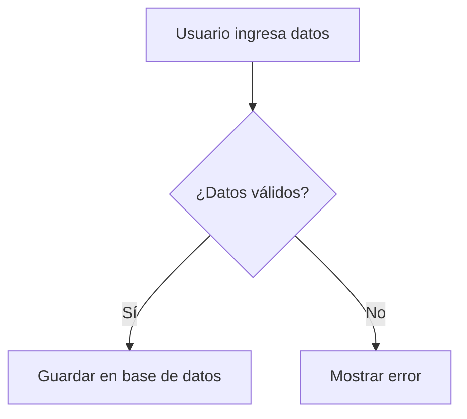

<section class="blog-reveal">

## 1. INTRODUCCIÓN

Toda herramienta CASE de **análisis y diseño** existe para resolver el mismo problema: convertir una idea todavía difusa en un modelo que el equipo pueda discutir, corregir e implementar. Como parte de la investigación breve solicitada, cada integrante del grupo seleccionó una herramienta —de análisis o de diseño— y la justificó frente a cuatro criterios comunes.

En esta publicación presentamos las dos primeras herramientas evaluadas: **Miro**, un pizarrón visual colaborativo, y **Mermaid**, diagramas generados a partir de texto. Ambas encajan en la categoría *Análisis y diseño* de la taxonomía de Pressman revisada en la UNIDAD 1, pero resuelven el problema desde ángulos opuestos.

rule

<strong class="text-[#7ea000]">Criterios de evaluación:</strong> facilidad de uso, funcionalidades, entorno colaborativo e integración — los mismos cuatro ejes se aplican a cada herramienta para poder compararlas de forma justa al final del artículo.

  <h3 class="text-base md:text-lg font-bold uppercase tracking-wider text-gray-900 mb-3 flex items-center gap-2">
    format_list_bulleted
    Tabla de Contenidos
  </h3>

  <ul class="space-y-2.5 !list-none !p-0 !m-0">

    <li class="!mb-1">
      <a href="#tema-1" class="inline-flex items-center gap-2.5 text-[#7ea000] hover:text-[#5c7500] font-semibold text-sm md:text-base transition-colors no-underline hover:underline">
        01.
        Introducción
      </a>
    </li>

    <li class="!mb-1">
      <a href="#tema-2" class="inline-flex items-center gap-2.5 text-[#7ea000] hover:text-[#5c7500] font-semibold text-sm md:text-base transition-colors no-underline hover:underline">
        02.
        Miro
      </a>
    </li>

    <li class="!mb-1">
      <a href="#tema-3" class="inline-flex items-center gap-2.5 text-[#7ea000] hover:text-[#5c7500] font-semibold text-sm md:text-base transition-colors no-underline hover:underline">
        03.
        Mermaid
      </a>
    </li>

    <li class="!mb-1">
      <a href="#tema-4" class="inline-flex items-center gap-2.5 text-[#7ea000] hover:text-[#5c7500] font-semibold text-sm md:text-base transition-colors no-underline hover:underline">
        04.
        Eraser.io
      </a>
    </li>

    <li class="!mb-1">
      <a href="#tema-5" class="inline-flex items-center gap-2.5 text-[#7ea000] hover:text-[#5c7500] font-semibold text-sm md:text-base transition-colors no-underline hover:underline">
        05.
        Figma
      </a>
    </li>

    <li class="!mb-1">
      <a href="#tema-6" class="inline-flex items-center gap-2.5 text-[#7ea000] hover:text-[#5c7500] font-semibold text-sm md:text-base transition-colors no-underline hover:underline">
        06.
        Comparación entre las herramientas
      </a>
    </li>

    <li class="!mb-1">
      <a href="#tema-7" class="inline-flex items-center gap-2.5 text-[#7ea000] hover:text-[#5c7500] font-semibold text-sm md:text-base transition-colors no-underline hover:underline">
        07.
        Conclusión
      </a>
    </li>

    <li class="!mb-1">
      <a href="#tema-8" class="inline-flex items-center gap-2.5 text-[#7ea000] hover:text-[#5c7500] font-semibold text-sm md:text-base transition-colors no-underline hover:underline">
        08.
        Referencias
      </a>
    </li>

  </ul>

</section>

<section class="blog-reveal">

## 2. MIRO: EL PIZARRÓN INFINITO

Cuando un equipo se sienta a **analizar un problema** o a **diseñar la arquitectura** de un sistema, lo primero que necesita no es código: necesita un lugar donde pensar en voz alta, juntos. Miro es un pizarrón digital colaborativo e infinito, pensado para que equipos distribuidos trabajen como si estuvieran frente al mismo tablero físico, sin límites de espacio ni ubicación.

  <figure class="m-0">
    
    <figcaption class="text-xs text-gray-500 mt-2 text-center">Pizarrón colaborativo con notas y flujos de proceso.</figcaption>
  </figure>
  <figure class="m-0">
    
    <figcaption class="text-xs text-gray-500 mt-2 text-center">Plantilla de diagrama UML lista para usar.</figcaption>
  </figure>

  

    

      01
      

        
Facilidad de uso

        
Arrastrar y soltar, sin instalación ni curva de aprendizaje; corre entero en el navegador.

      

    

    

      02
      

        
Funcionalidades

        
Plantillas de historias de usuario, mapas de empatía, UML y arquitecturas; frameworks Kanban y Lean Canvas integrados.

      

    

    

      03
      

        
Entorno colaborativo

        
Edición simultánea con cursores en vivo, comentarios, videollamada y modo presentación desde el mismo tablero.

      

    

    

      04
      

        
Integración

        
Conecta de forma nativa con Jira, Trello, Asana, Slack, Google Drive y Figma; exporta a PDF, PNG o CSV.

      

    

  

  
  
Un tablero de Miro conectado a Jira: la idea nace en el pizarrón y termina en el backlog.

### 2.1 ¿Cuándo usarla en el ciclo de vida del software?

  

    Levantamiento de requisitos
    Mapas mentales y entrevistas visuales con el cliente.
  

  

    Análisis
    Diagramas de procesos, actores y casos de uso.
  

  

    Diseño
    Wireframes rápidos, arquitecturas y flujos de datos.
  

  

    Retrospectivas
    Tableros Kanban, votaciones y feedback del sprint.
  

  
🔗 Pruébala en <a href="https://miro.com" class="text-[#7ea000] font-semibold hover:underline">miro.com</a>

</section>

<section class="blog-reveal">

## 3. MERMAID: EL DIAGRAMA COMO CÓDIGO

No todos los equipos quieren "dibujar" un diagrama con el mouse. Algunos prefieren **escribirlo**, igual que escriben código. Para ese perfil de equipo —técnico, orientado a Git, minimalista— existe Mermaid: una herramienta que convierte texto plano en diagramas de análisis y diseño de software.

  <figure class="m-0">
    
    <figcaption class="text-xs text-gray-500 mt-2 text-center">Diagrama de flujo renderizado a partir de texto plano.</figcaption>
  </figure>
  <figure class="m-0">
    
    <figcaption class="text-xs text-gray-500 mt-2 text-center">Mermaid Live Editor: código a la izquierda, diagrama en vivo a la derecha.</figcaption>
  </figure>

  

    

      
      
      
      flowchart.mmd
    

    code
  

  

  

  

    

      01
      

        
Facilidad de uso

        
Sintaxis simple, similar a Markdown; el layout se genera automáticamente, sin alinear cajas a mano.

      

    

    

      02
      

        
Funcionalidades

        
Diagramas de flujo, clases, entidad-relación, secuencia, estado y Gantt, todo desde el mismo lenguaje.

      

    

    

      03
      

        
Entorno colaborativo

        
Colaboración vía Git: los diagramas se versionan y se revisan en Pull Requests, comentario por línea.

      

    

    

      04
      

        
Integración

        
Renderiza nativo en GitHub, GitLab y Notion; vista previa en vivo en VS Code; compatible con Astro, Docusaurus y MkDocs.

      

    

  

  
  
Bloque de código se renderiza automáticamente dentro de un README de GitHub.

### 3.1 ¿Cuándo usarla en el ciclo de vida del software?

  

    Análisis
    Diagramas de casos de uso y de flujo de procesos.
  

  

    Diseño
    Diagramas de clases, entidad-relación y secuencia.
  

  

    Documentación técnica
    Diagramas embebidos directamente en el README o la wiki del repositorio.
  

  

    Planificación
    Diagramas de Gantt para cronogramas del proyecto.
  

  
🔗 Pruébala en <a href="https://mermaid.js.org" class="text-[#7ea000] font-semibold hover:underline">mermaid.js.org</a> o en el <a href="https://mermaid.live" class="text-[#7ea000] font-semibold hover:underline">Mermaid Live Editor</a>

</section>

<section class="blog-reveal">

## 4. COMPARACIÓN ENTRE  HERRAMIENTAS

## 5. CONCLUSIÓN

Miro y Mermaid no compiten entre sí: **se complementan**. Miro es el espacio ideal para las sesiones grupales de análisis, donde el equipo necesita pensar y discutir en tiempo real sobre el mismo lienzo, con la ventaja de que cualquier integrante —sin importar su nivel técnico— puede participar de inmediato. Mermaid, en cambio, es la herramienta correcta cuando el diagrama debe **vivir junto al proyecto**: versionarse con cada commit, revisarse en Pull Requests y mantenerse siempre actualizado sin depender de licencias externas.

Para un equipo que recién está definiendo su flujo de trabajo con herramientas CASE, la combinación de ambas cubre los dos extremos del proceso: **la exploración visual de ideas** al inicio del análisis, y **la documentación técnica reproducible** durante el diseño y la construcción.

</section>

<section class="blog-reveal">

## 6. REFERENCIAS

Miro. (2026). *Miro: A Collaborative Digital Whiteboard for Teams*. Recuperado de https://miro.com

Mermaid.js Contributors. (2026). *Mermaid — Diagramming and charting tool*. Recuperado de https://mermaid.js.org

Universidad Técnica de Ambato, Facultad de Ingeniería en Sistemas, Electrónica e Industrial, Carrera de Software. (2025). *Unidad 1: Ingeniería de Software Asistida por Computadora (CASE)* [Apunte de clase, asignatura Desarrollo Asistido por Software].

</section>